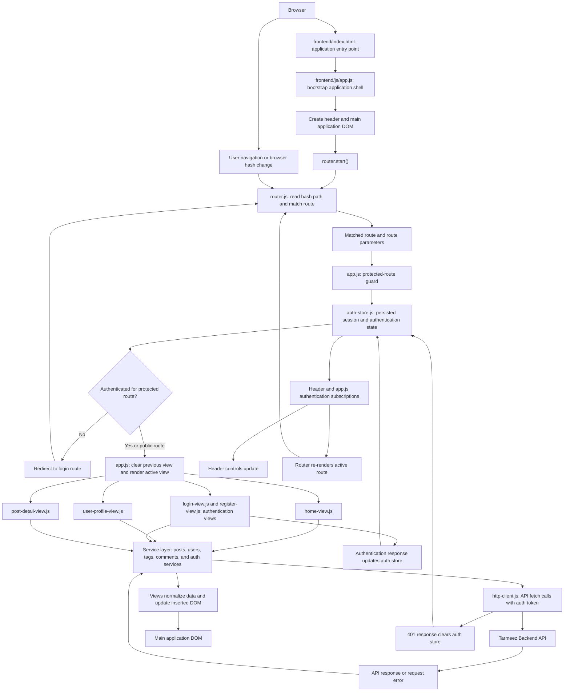

# Tarmeez Application Architecture Guide

This guide describes Tarmeez through progressive levels of detail. Level 1 presents the system-wide request, routing, authentication, rendering, and data-flow boundaries. Later levels will document individual features and implementation paths without repeating this architectural overview.

## Level 1: System High-Level Architecture

At startup, `index.html` loads `app.js`, which mounts the application shell and starts hash-based routing. Each matched route passes through the authentication guard before a view is inserted into the main DOM. Views request data through services and the shared HTTP client; successful and failed responses update the active UI. Authentication state changes notify the header and re-render the current route so the visible interface remains consistent with the session.
