# Tarmeez Application Architecture Guide

This guide describes Tarmeez through progressive levels of detail. Level 1 presents the system-wide request, routing, authentication, rendering, and data-flow boundaries. Later levels will document individual features and implementation paths without repeating this architectural overview.

## Level 1: System High-Level Architecture

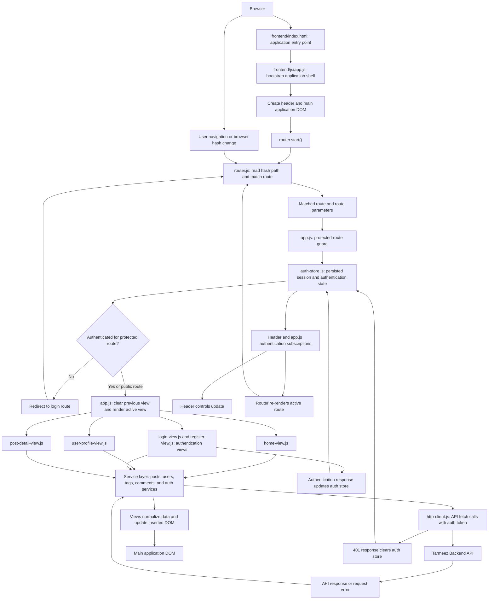

At startup, `index.html` loads `app.js`, which mounts the application shell and starts hash-based routing. Each matched route passes through the authentication guard before a view is inserted into the main DOM. Views request data through services and the shared HTTP client; successful and failed responses update the active UI. Authentication state changes notify the header and re-render the current route so the visible interface remains consistent with the session.

## Level 2: Screen & View Lifecycle Flowcharts

This level documents the internal lifecycle of each rendered view: how it loads data, renders DOM, and reacts to user actions without a full page reload.

### Home View (`home-view.js`)

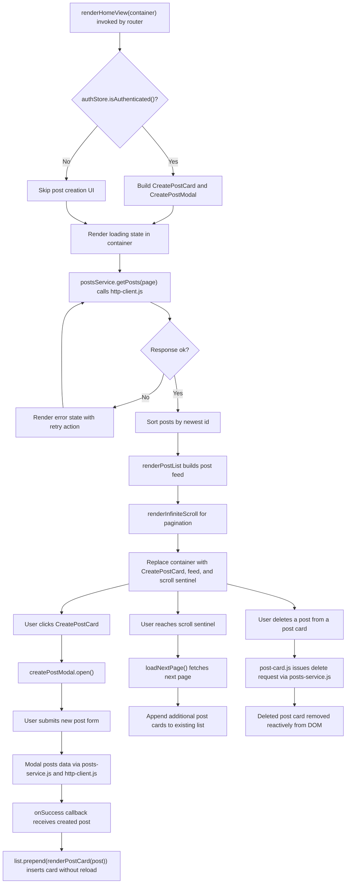

### User Profile View (`user-profile-view.js`)

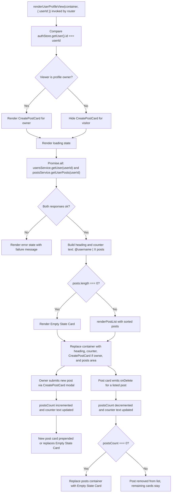

### Auth Views (`login-view.js` and `register-view.js`)

The application implements login and registration as two dedicated views rather than a single combined auth view, sharing the same submit-validate-store lifecycle.

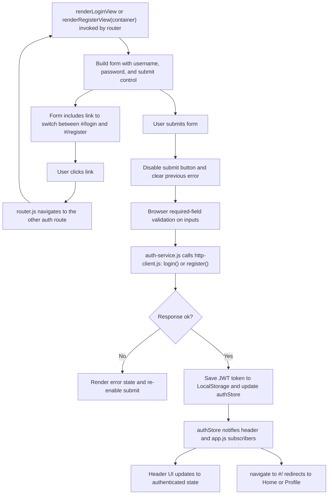

### Post Detail View (`post-detail-view.js`)

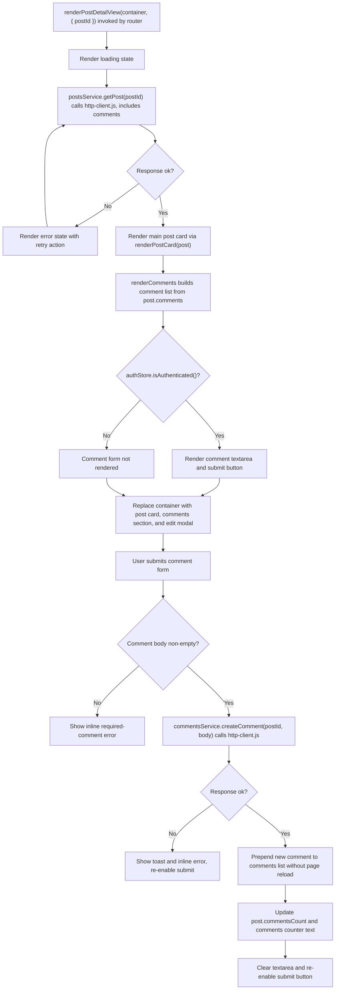

## Level 3: Core Modules & Services Flowcharts

### Router Service (`router.js`)

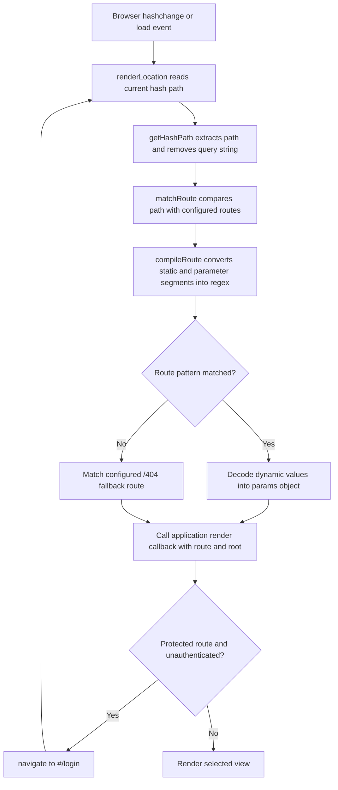

The router listens for hash changes and initial page load. It matches both static paths and parameterized paths such as `/users/:userId`; `app.js` performs the protected-route guard in its render callback before rendering a view.

### HTTP Client Service (`http-client.js`)

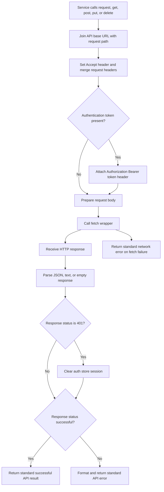

### Auth Store (`auth-store.js`)

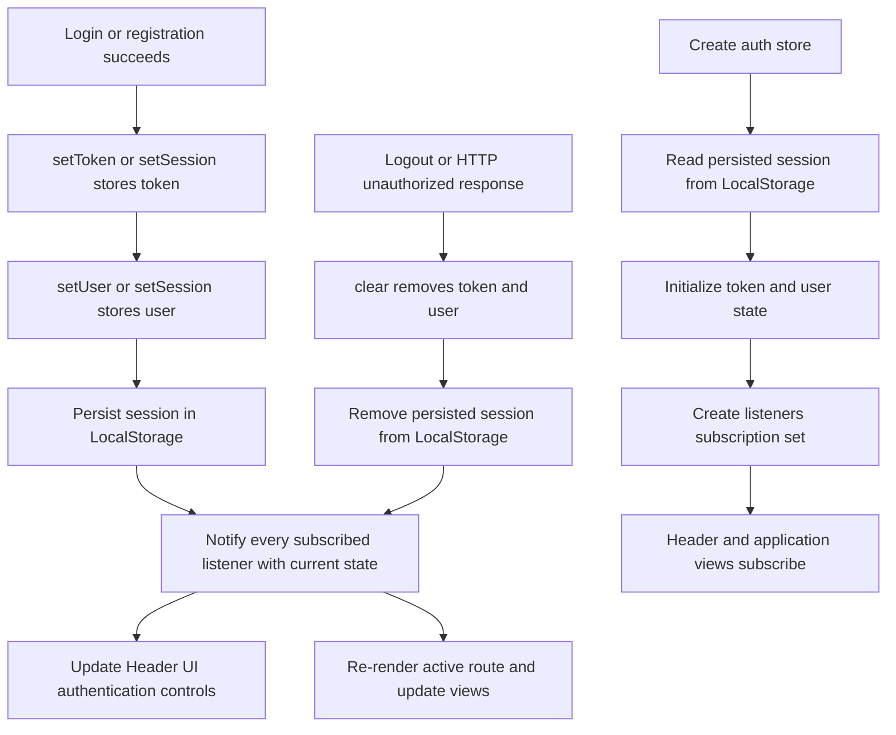

## Level 4: Code-Level Function Call & Execution Sequence

### 4.1 User Roles, Permissions & Post Creation Function Execution Flow

```mermaid
flowchart TD
    subgraph PartA["Part A: User Roles and Permission Checks"]
        GuestStart["Guest User"] --> GuestFeed["View public post feed"]
        GuestStart --> GuestDetail["View post details"]
        GuestStart --> GuestProfile["View public user profiles"]
        GuestStart --> GuestBlocked["Attempt create/edit/delete post or comment"]
        GuestBlocked --> GuestRedirect["Redirect to login/register views"]
        GuestRedirect --> LoginView["login-view.js"]
        GuestRedirect --> RegisterView["register-view.js"]

        LoginView --> LoginSubmit["Submit login form"]
        RegisterView --> RegisterSubmit["Submit registration form"]
        LoginSubmit --> AuthService["auth-service.js"]
        RegisterSubmit --> AuthService
        AuthService --> AuthSuccess["Successful auth response"]
        AuthSuccess --> SaveToken["auth-store.js: save JWT token and user session"]
        SaveToken --> AuthUser["Authenticated User"]

        AuthUser --> CreatePostAccess["Create new posts"]
        AuthUser --> CommentAccess["Comment on posts"]
        AuthUser --> EditOwn["Edit own posts"]
        AuthUser --> DeleteOwn["Delete own posts"]
        AuthUser --> FullAccess["Full privileges unlocked"]
    end

    subgraph PartB["Part B: Post Creation Execution Sequence"]
        StartCreate["Authenticated user starts post creation"] --> AuthCheck{"authStore.isAuthenticated() returns true?"}
        AuthCheck -->|"Yes"| TriggerClick["User clicks create-post trigger card"]
        AuthCheck -->|"No"| BlockedCreate["Block action and redirect to login"]

        TriggerClick --> OpenModal["openCreatePostModal()"]
        OpenModal --> SubmitHandler["Form submit listener fires: handlePostSubmit(event)"]
        SubmitHandler --> PayloadBuild["Construct request payload from form input"]
        PayloadBuild --> ApiCall["http-client.js: post('/posts', body)"]
        ApiCall --> ResponseCheck{"Response status is 201 Created?"}
        ResponseCheck -->|"Yes"| OnSuccess["onSuccess(newPost)"]
        ResponseCheck -->|"No"| ErrorState["Display API or validation error"]

        OnSuccess --> RenderCard["renderPostCard(newPost)"]
        RenderCard --> PrependDom["feedContainer.prepend(postElement)"]
        PrependDom --> UpdateState["incrementPostCounter() and hide .user-posts__empty if visible"]
        UpdateState --> SuccessEnd["New post appears at top of feed"]
    end
```

This Level 4 adds the code-level permission model and the exact function chain for creating a post. Guests can browse publicly, while any write attempt is intercepted and redirected to authentication. Once authenticated, the post flow progresses through modal open, submit handler, HTTP request, success callback, DOM insertion, and state updates that make the new post immediately visible in the current feed.

### 4.2 Post Edit & Deletion Execution Flow

```mermaid
flowchart TD
    subgraph PartA["Part A: Post Deletion Sequence"]
        DeleteClick["User clicks delete icon in post-card.js"] --> OwnershipCheck{"post.author.id === currentUser.id?"}
        OwnershipCheck -->|"No"| DenyDelete["Do not expose or execute delete action"]
        OwnershipCheck -->|"Yes"| OpenConfirm["renderConfirmModal() opens delete confirmation"]
        OpenConfirm --> ConfirmDelete["User confirms delete action"]
        ConfirmDelete --> DeletePost["postsService.deletePost(postId)"]
        DeletePost --> DeleteRequest["http-client.js: delete('/posts/' + postId)"]
        DeleteRequest --> DeleteResult{"API returns 200 OK?"}
        DeleteResult -->|"No"| DeleteError["Show deletion error in confirmation modal"]
        DeleteResult -->|"Yes"| RemoveCard["postElement.remove() removes the card without page reload"]
        RemoveCard --> DeleteCallback["onDelete(post) updates profile state"]
        DeleteCallback --> DecrementCount["Decrement counter: @username | X posts"]
        DecrementCount --> EmptyCheck{"Remaining profile post elements === 0?"}
        EmptyCheck -->|"Yes"| InjectEmpty["Inject .user-posts__empty"]
        EmptyCheck -->|"No"| KeepPosts["Keep remaining profile post elements"]
    end

    subgraph PartB["Part B: Post Editing Sequence"]
        EditClick["User clicks edit icon in post-card.js"] --> EditOwnership{"post.author.id === currentUser.id?"}
        EditOwnership -->|"No"| DenyEdit["Do not expose or execute edit action"]
        EditOwnership -->|"Yes"| EmitEdit["onEdit(post) opens the edit modal"]
        EmitEdit --> PrefillModal["createPostModal.open(post) sets editingPost and pre-fills text and image data"]
        PrefillModal --> EditingMode["isEditing is true while editingPost is present"]
        EditingMode --> EditSubmit["Form submit triggers handlePostEdit(event)"]
        EditSubmit --> UpdatePost["postsService.updatePost(postId, updatedBody)"]
        UpdatePost --> PutRequest["http-client.js: put('/posts/' + postId, updatedBody)"]
        PutRequest --> EditResult{"API returns updated post object?"}
        EditResult -->|"No"| EditError["Show validation or API error in modal"]
        EditResult -->|"Yes"| EditSuccess["onSuccess(updatedPost) receives updated post data"]
        EditSuccess --> UpdateCard["Update title, body, and image in the existing post card without re-rendering the feed list"]
    end
```

This flow follows the post-card action handlers through confirmation or editing state, the post service, and reactive UI updates. Deletion removes the existing card and updates the profile counter; editing updates the current card from the returned post data.

### 4.3 Comments & Session Lifecycle Execution Flow

```mermaid
flowchart TD
    subgraph PartA["Part A: Comment Creation Sequence"]
        NavigateDetail["User navigates to #/posts/:id"] --> RenderDetail["renderPostDetailView(container, { postId })"]
        RenderDetail --> Authenticated["Authenticated user sees comment form"]
        Authenticated --> TypeComment["User types comment text"]
        TypeComment --> SubmitComment["User clicks Comment submit button"]
        SubmitComment --> HandleSubmit["Inline handleCommentSubmit(event) form submit listener"]
        HandleSubmit --> PreventDefault["event.preventDefault() and input.value.trim()"]
        PreventDefault --> ValidBody{"Comment body is non-empty?"}
        ValidBody -->|"No"| ValidationError["Display required-comment error"]
        ValidBody -->|"Yes"| CreateComment["commentsService.createComment(postId, body)"]
        CreateComment --> PostRequest["http-client.js: post('/posts/' + postId + '/comments', body)"]
        PostRequest --> Created{"API returns 201 Created?"}
        Created -->|"No"| CommentError["Show toast and inline error, then re-enable submit"]
        Created -->|"Yes"| NewComment["Receive new comment object"]
        NewComment --> AppendComment["commentsList.prepend(renderCommentItem(createdComment))"]
        AppendComment --> UpdateComments["Add new comment to post.comments"]
        UpdateComments --> IncrementCount["Increment post.commentsCount and update counter text"]
        IncrementCount --> ResetForm["Clear textarea and re-enable submit without page refresh"]
    end

    subgraph PartB["Part B: Session Lifecycle and Auto-Logout Flow"]
        LogoutStart["User initiates logout from Header"] --> HeaderLogout["Header invokes onLogout callback"]
        HeaderLogout --> ServiceLogout["authService.logout()"]
        ServiceLogout --> ClearSession["authStore.clear() acts as logout"]
        ClearSession --> ClearState["Set JWT token and user object to null"]
        ClearState --> ClearStorage["Remove tarmeez.auth from LocalStorage"]
        ClearStorage --> NotifySubscribers["Notify authStore subscribers"]
        NotifySubscribers --> HeaderGuest["Header UI updates to Guest state"]
        NotifySubscribers --> RerenderRoute["app.js subscription calls router.render()"]
        RerenderRoute --> ProtectedCheck{"Current route requires authentication?"}
        ProtectedCheck -->|"Yes"| LoginRedirect["router.navigate('#/login')"]
        ProtectedCheck -->|"No"| PublicRoute["Re-render current public route as guest"]

        AnyRequest["Any http-client.js request"] --> Response401{"Response status is 401 Unauthorized?"}
        Response401 -->|"No"| NormalResponse["Return standard API success or error result"]
        Response401 -->|"Yes"| AutoClear["http-client.js calls authStore.clear()"]
        AutoClear --> ClearState
    end
```

Comment creation keeps the detail view mounted: its submit listener validates the body, creates the comment through the service and HTTP client, then prepends the returned element and updates the in-memory count. Session clearing is shared by explicit logout and unauthorized API responses; store subscribers refresh the header and rerun route protection, which redirects protected views to `#/login`.
