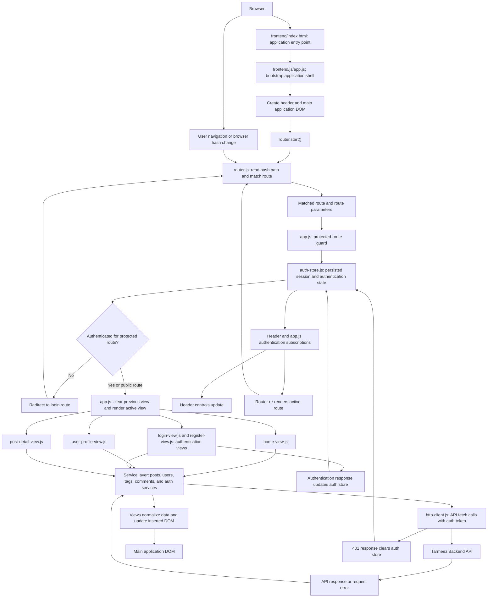
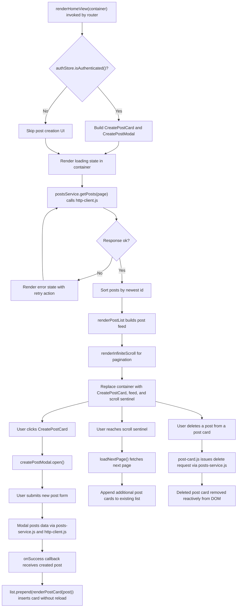
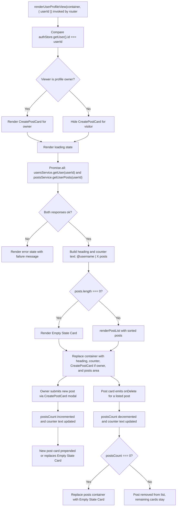
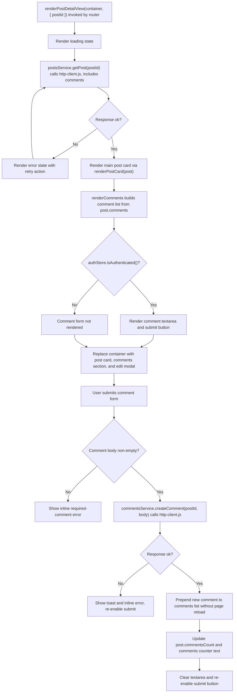

# Tarmeez Application Architecture Guide

This guide describes Tarmeez through progressive levels of detail. Level 1 presents the system-wide request, routing, authentication, rendering, and data-flow boundaries. Later levels will document individual features and implementation paths without repeating this architectural overview.

## Level 1: System High-Level Architecture



At startup, `index.html` loads `app.js`, which mounts the application shell and starts hash-based routing. Each matched route passes through the authentication guard before a view is inserted into the main DOM. Views request data through services and the shared HTTP client; successful and failed responses update the active UI. Authentication state changes notify the header and re-render the current route so the visible interface remains consistent with the session.

## Level 2: Screen & View Lifecycle Flowcharts

This level documents the internal lifecycle of each rendered view: how it loads data, renders DOM, and reacts to user actions without a full page reload.

### Home View (`home-view.js`)



### User Profile View (`user-profile-view.js`)



### Auth Views (`login-view.js` and `register-view.js`)

The application implements login and registration as two dedicated views rather than a single combined auth view, sharing the same submit-validate-store lifecycle.

```mermaid
flowchart TD
    Mount["renderLoginView or renderRegisterView(container) invoked by router"] --> BuildForm["Build form with username, password, and submit control"]
    BuildForm --> TabLink["Form includes link to switch between #/login and #/register"]
    TabLink --> UserSwitch["User clicks link"]
    UserSwitch --> Router["router.js navigates to the other auth route"]
    Router --> Mount

    BuildForm --> UserSubmits["User submits form"]
    UserSubmits --> DisableSubmit["Disable submit button and clear previous error"]
    DisableSubmit --> Validate["Browser required-field validation on inputs"]
    Validate --> AuthRequest["auth-service.js calls http-client.js: login() or register()"]
    AuthRequest --> AuthResult{"Response ok?"}
    AuthResult -->|"No"| ShowFormError["Render error state and re-enable submit"]
    AuthResult -->|"Yes"| StoreToken["Save JWT token to LocalStorage and update authStore"]
    StoreToken --> NotifySubscribers["authStore notifies header and app.js subscribers"]
    NotifySubscribers --> HeaderUpdate["Header UI updates to authenticated state"]
    NotifySubscribers --> Redirect["navigate(\"#/\") redirects to Home or Profile"]
```

### Post Detail View (`post-detail-view.js`)


