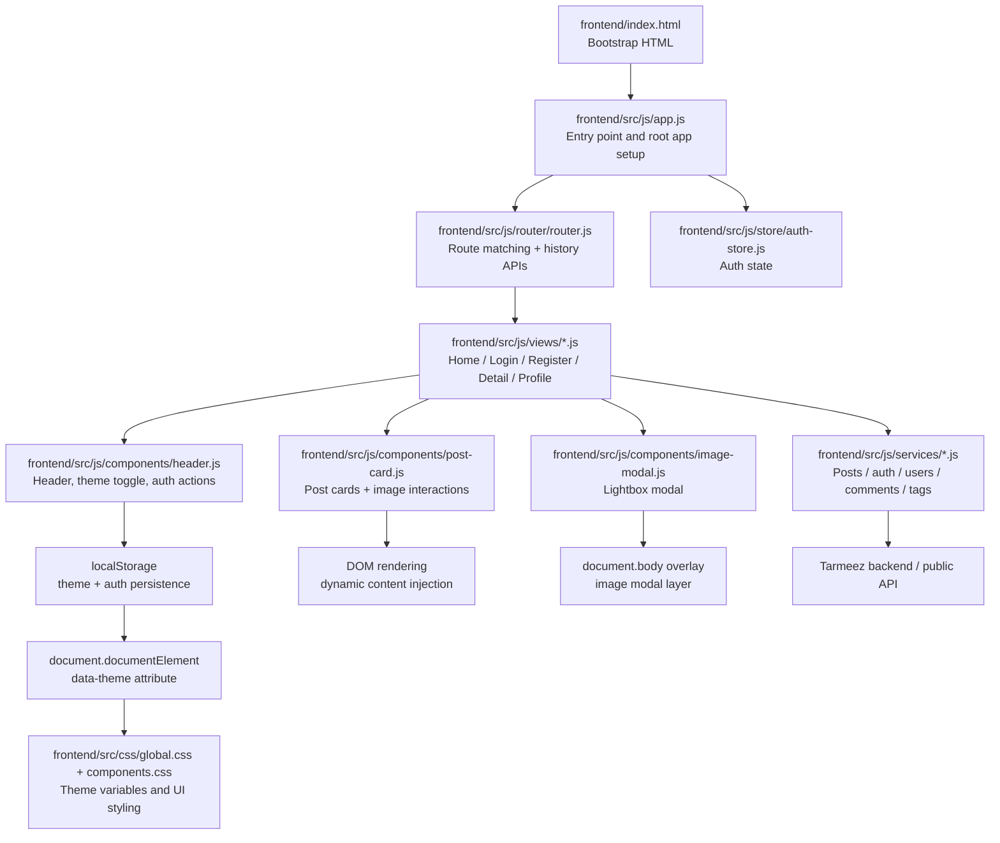
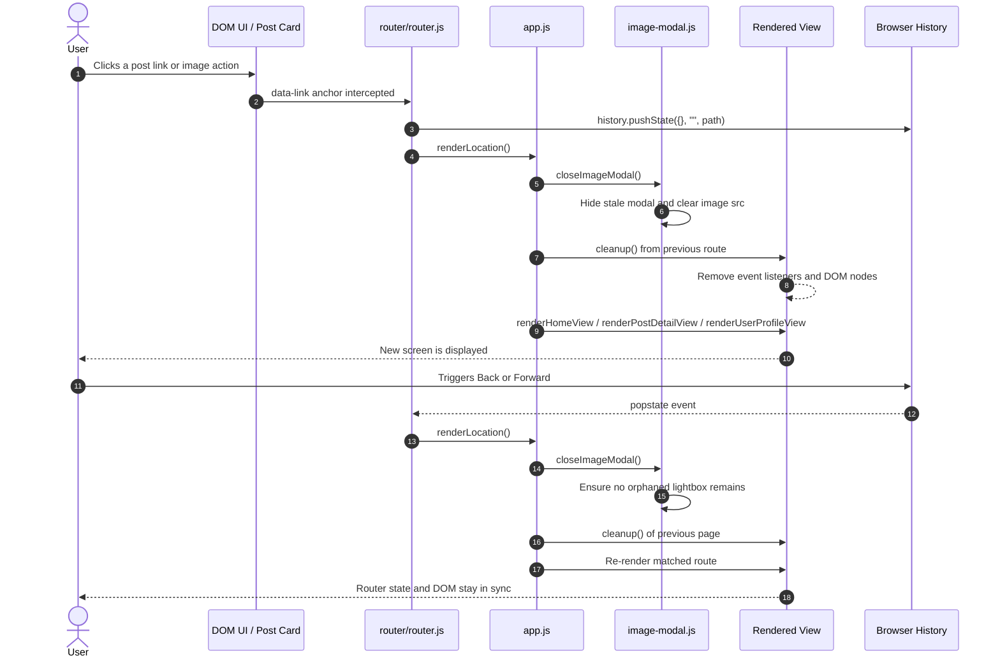
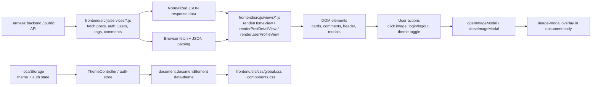

# Tarmeez Frontend Architecture & Flow Diagrams

This document maps the browser-side execution flow of the Tarmeez SPA using the actual structure in the frontend: a static HTML bootstrap, an app entry module, a custom router, view renderers, and DOM components for the header, post cards, and modal lightbox.

## 1. System Architecture Diagram



## 2. Application User Flow

```mermaid
flowchart TD
    A[Page Load] --> B[HTML loads CSS and app.js]
    B --> C[Theme bootstrap reads localStorage]
    C --> D{Saved theme exists?}
    D -- Yes --> E[Apply saved theme to documentElement]
    D -- No --> F[Use prefers-color-scheme fallback]
    E --> G[Render header shell]
    F --> G
    G --> H[Router resolves current path]
    H --> I[Fetch posts or route-specific data]
    I --> J[Render view content]
    J --> K{User interaction}
    K -->|Click post image| L[openImageModal(src, alt)]
    L --> M[Lightbox opens]
    M --> N{Dismiss modal}
    N -->|Esc key| O[closeImageModal]
    N -->|Backdrop click| O
    N -->|Browser back/forward| O
    O --> P[Modal hidden and image cleared]
    K -->|Click email icon| Q[Copy developer email to clipboard]
    Q --> R[Show toast notification]
    K -->|Use data-link nav| S[history.pushState + router render]
```

## 3. SPA Navigation & Event Lifecycle



## 4. Data & State Management Flow



## Architectural Notes

- The bootstrap is [frontend/index.html](frontend/index.html), which loads the CSS bundle and the module entry.
- [frontend/src/js/app.js](frontend/src/js/app.js) mounts the main app area, initializes the router, and renders the sticky header.
- [frontend/src/js/router/router.js](frontend/src/js/router/router.js) owns route matching, click interception on elements with data-link, and browser history updates.
- [frontend/src/js/components/header.js](frontend/src/js/components/header.js) handles theme toggling, auth state display, logout/login actions, and the email copy interaction.
- [frontend/src/js/components/post-card.js](frontend/src/js/components/post-card.js) renders each post, attaches image preview behavior, and contains the interaction controls for detail and action menus.
- [frontend/src/js/components/image-modal.js](frontend/src/js/components/image-modal.js) manages the modal lifecycle, including Escape keys, backdrop dismissal, and route-driven cleanup.
- Theme persistence is shared between the bootstrap script in [frontend/index.html](frontend/index.html) and the controller in [frontend/src/js/utils/theme.js](frontend/src/js/utils/theme.js); styling values are defined in [frontend/src/css/global.css](frontend/src/css/global.css) and [frontend/src/css/components.css](frontend/src/css/components.css).

This file intentionally documents the frontend structure and flow instead of modifying any source code behavior.

- `AuthForm`: shared validation and submission presentation for login/register variants.
- `Pagination`: consumes pagination metadata and emits page changes.
- `LoadingState`: pending request feedback.
- `EmptyState`: successful request with no items.
- `ErrorState`: retry and human-readable API failure state.
- `ConfirmDialog`: confirmation before destructive actions.
- `ImageWithFallback`: handles missing, object-valued, invalid, or failed image URLs.

## 7. Proposed Directory Structure

```text
frontend/
  index.html
  assets/
    fonts/
    icons/
    images/
  src/
    css/
      global.css
      components.css
    js/
      app.js
      router/
        router.js
        routes.js
      services/
        http-client.js
        auth-service.js
        users-service.js
        posts-service.js
        comments-service.js
        tags-service.js
      store/
        auth-store.js
        app-store.js
      components/
        app-shell.js
        header.js
        navigation.js
        post-card.js
        post-list.js
        post-detail.js
        user-card.js
        user-profile.js
        tag-list.js
        tag-badge.js
        comment-list.js
        comment-form.js
        auth-form.js
        pagination.js
        loading-state.js
        empty-state.js
        error-state.js
        confirm-dialog.js
        image-with-fallback.js
      views/
        home-view.js
        post-detail-view.js
        users-view.js
        profile-view.js
        tags-view.js
        login-view.js
        register-view.js
        settings-view.js
        not-found-view.js
      utils/
        api-normalizers.js
        query-params.js
        url.js
        dates.js
        images.js
        validation.js
        escape-html.js
```

The repository currently has `components/`, `router/`, `services/`, and `views/` directories. The proposed `store/` and `utils/` directories are additions to keep state and pure transformations separate from views and API access. CSS may remain in the existing `src/css/` location rather than introducing a separate `styles/` directory.

## 8. Layer Responsibilities and Data Flow

```text
User interaction
      |
      v
Route-level view
      |
      v
Resource service
      |
      v
Shared HTTP client
      |
      v
Tarmeez API
```

### Bootstrap

`app.js` creates the router, initializes the auth store, mounts `AppShell`, and triggers the initial route render.

### Router

`router/router.js` and `router/routes.js` own:

- History API navigation.
- Link interception for internal `data-link` anchors.
- Route matching and path parameter extraction.
- Rendering the correct view.
- Dispatching the not-found view.
- Re-rendering on browser back and forward.

### Views

Views orchestrate a route. They read route parameters, request data through resource services, update application state, and compose components. Views own loading, empty, error, and retry behavior for their route.

### Services

Resource services own endpoint paths and resource-specific payload construction. They return normalized domain models or structured errors to views. They do not manipulate DOM.

### HTTP client

`http-client.js` owns:

- Base URL joining.
- `Accept` and body headers.
- Bearer token injection.
- JSON request serialization.
- `FormData` handling.
- Empty response handling.
- JSON parsing.
- HTTP status classification.
- Normalized API errors.

### Stores

- `auth-store.js`: token, authenticated user snapshot if available, login/logout state, and local persistence.
- `app-store.js`: request state and transient UI state where a shared store is useful.

Persist only the minimum session data needed by the browser. The actual token field cannot be selected until the login response is verified.

## 9. Authentication and Security Rules

- Treat register and login as public requests.
- Attach `Authorization: Bearer <token>` only when a token exists and the endpoint requires it.
- Never log passwords, access tokens, or complete credential payloads.
- Clear local auth state on logout and on a confirmed 401 response.
- Redirect protected actions to `/login` when no token is available.
- Represent 401, 403, 404, 422, 429, and 5xx errors distinctly when the API provides those statuses.
- Use `URLSearchParams` for page numbers and future query filters.
- Escape user-controlled text before inserting it into the DOM. Prefer `textContent` and DOM APIs over unsafe `innerHTML`.
- Avoid trusting API URLs blindly. Validate image values and use a fallback when the value is missing, an object, malformed, or fails to load.
- Do not store passwords.
- Treat ownership checks as server-side authorization. Client-side controls only improve presentation and are not security boundaries.

## 10. Loading, Error, and Mutation Behavior

Every data view should provide explicit states:

1. Loading while the request is pending.
2. Content when data is available.
3. Empty state when a successful list contains no records.
4. Retryable error state for network failures and 5xx responses.
5. Authentication prompt for 401 responses.
6. Permission message for 403 responses.
7. Not-found message for 404 responses.
8. Validation feedback for 422 responses.
9. Rate-limit feedback for 429 responses.

Destructive post and comment actions should require confirmation. After a successful delete, update the relevant view by refetching or removing the deleted item from the local view state. Avoid optimistic mutation until the API's mutation responses and failure semantics are verified.

## 11. Open Questions and Verification Checklist

Before implementing the service methods and mutation forms, verify:

- The successful `POST /login` response body and exact token field.
- Whether login returns a user object as well as a token.
- The successful `POST /register` response and whether it creates a session.
- Exact success status codes and bodies for register, login, logout, post creation, post deletion, comment creation, and comment deletion.
- Whether logout requires a body or only the bearer token.
- Whether comments require JSON or multipart/form-data.
- Exact `POST /posts` field names, required fields, image behavior, and tag representation.
- Whether `PUT` or `PATCH` post updates are supported.
- Which post query filters are supported and how they are named.
- Whether standalone `GET /posts/{postId}/comments` is intentionally unsupported or temporarily failing.
- Whether `/tags/{tag}` is unsupported and whether tag navigation should instead use a post filter.
- Validation error shapes and the API's behavior for 401, 403, 404, 422, 429, and 500 responses.
- CORS behavior when the browser calls the remote API directly.

## 12. Explicitly Deferred Features

The first implementation plan excludes the following until their API contracts are verified:

- Profile editing.
- Tag-detail pages based on `GET /tags/{tag}`.
- A standalone comments page or dependency on `GET /posts/{postId}/comments`.
- Post update forms using PUT or PATCH.
- Unverified post filtering controls.
- An optimistic mutation/cache layer.
- An Express API proxy, unless direct browser requests fail due to CORS.

## 13. Existing Project Integration

The architecture fits the current project as follows:

- `server.js` continues serving static assets and the SPA fallback.
- `frontend/index.html` remains the module entry point.
- `frontend/src/js/app.js` becomes the application bootstrap.
- `frontend/src/js/router/router.js` owns client-side navigation.
- `frontend/src/js/services/` owns API access.
- `frontend/src/js/components/` owns reusable DOM UI.
- `frontend/src/js/views/` owns route-level orchestration.
- `package.json` currently contains Express only and does not require a frontend framework or additional dependency for this architecture.

This separation keeps API details out of presentation code and leaves the application ready for incremental implementation once the unresolved API contracts have been tested.
