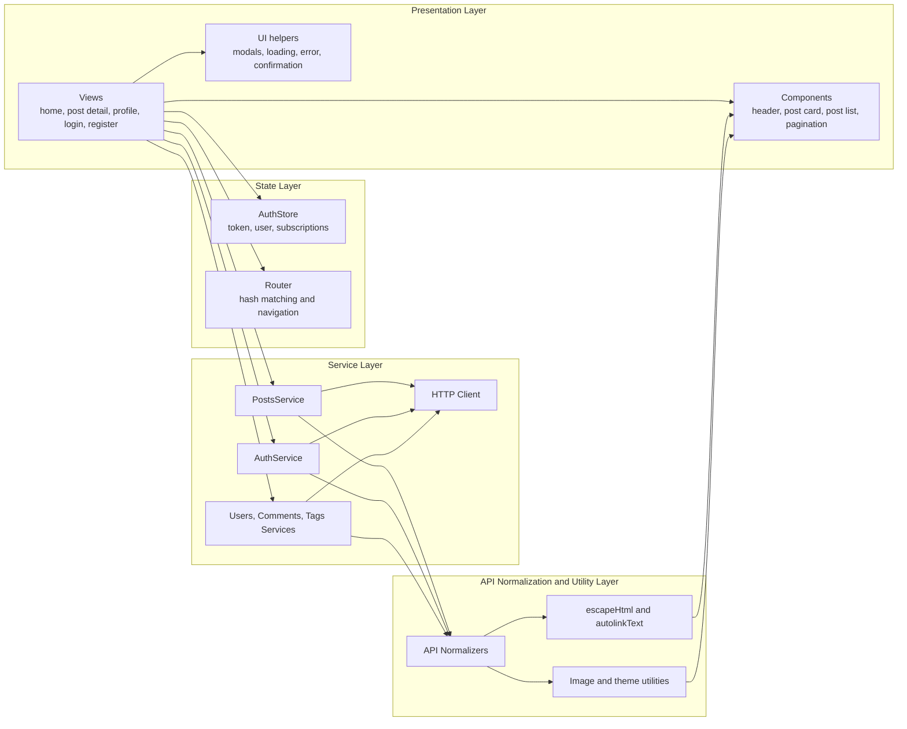
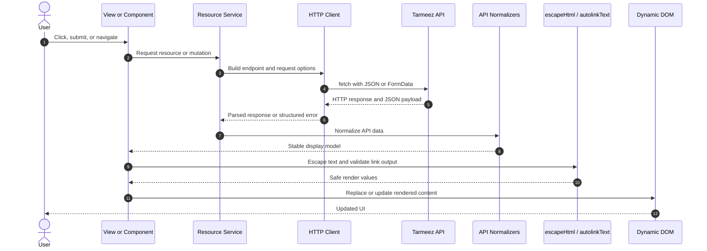
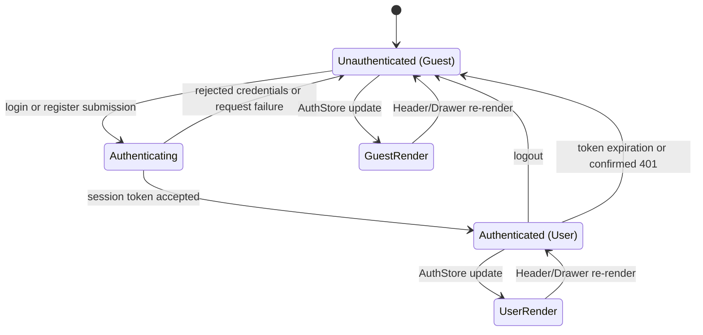

# Tarmeez SPA - System Architecture & Code Roadmap v2.0

**Document purpose:** A technical reference for the Tarmeez single-page application (SPA), describing its browser execution model, component and service boundaries, safe rendering path, and authentication behavior.

**Application entry point:** `frontend/index.html`  
**Client bootstrap:** `frontend/js/app.js`  
**Server role:** `server.js` serves the frontend and SPA fallback routes.

## 1. Code Execution Roadmap

Tarmeez is a static JavaScript SPA driven by URL hash routes. The browser loads the entry HTML and ES module bootstrap, which installs the application shell, starts routing, and renders the matched view. Each route render closes transient UI, invokes the previous view cleanup function, and installs the next view's cleanup function.

```mermaid
graph TD
    A[frontend/index.html<br/>HTML, CSS, module entry] --> B[frontend/js/app.js<br/>Create app shell]
    B --> C[renderHeader<br/>Header and auth controls]
    B --> D[createRouter<br/>router.js]
    D --> E[Hash resolution<br/>#/ | #/users/:id | #/posts/:id]
    E --> F{Matched route}
    F -->|home| G[renderHomeView]
    F -->|user profile| H[renderUserProfileView]
    F -->|post detail| I[renderPostDetailView]
    F -->|authentication| J[renderLoginView / renderRegisterView]
    G --> K[View initialization<br/>Fetch and prepare data]
    H --> K
    I --> K
    J --> K
    K --> L[Component rendering<br/>Cards, forms, pagination, modals]
    L --> M[Route change or auth update]
    M --> N[closeImageModal and previous cleanup]
    N --> E
```

### Runtime responsibilities

- `index.html` loads global styles and the JavaScript module entry point.
- `app.js` creates the `main#app` mount point, renders the persistent header, starts the router, and re-renders the active route when `AuthStore` changes.
- `router.js` parses the hash path, extracts route parameters, intercepts `a[data-link]` navigation, and responds to `hashchange` and browser load events.
- Route views own their request lifecycle and return a cleanup function for route-scoped listeners and UI.
- `app.js` always calls the old cleanup function before rendering a new route, preventing stale listeners and stale protected controls.

## 2. Component Architecture & Layering

Views orchestrate route-specific work. Reusable components render focused pieces of the user interface. Services isolate HTTP and endpoint behavior, while normalizers and utilities convert untrusted API values into safe display-ready values.



### Ownership boundaries

- **Views** compose a page, coordinate service requests, and select loading, error, empty, or content states.
- **Components** render reusable DOM fragments and attach local interaction handlers.
- **AuthStore** persists the session in local storage and notifies subscribers after every state update.
- **Router** is the sole owner of hash route matching and SPA navigation.
- **Services** call the public API through `http-client.js`; they do not manipulate the DOM.
- **Normalizers and utilities** handle inconsistent API shapes, text escaping, trusted links, images, and theme persistence before values reach rendered HTML.

## 3. Data Flow & Security Sequence

All remote response data is treated as untrusted. The route view requests data through a service, normalizes its shape, sanitizes display text, and then updates the dynamic DOM. Where direct HTML is required for controlled markup such as links, text is escaped before insertion.



### Security rules

- `escapeHtml` encodes HTML-significant characters in user-controlled text.
- `autolinkText` escapes non-link text and emits external links with `target="_blank"` and `rel="noopener noreferrer"`.
- The HTTP client adds bearer credentials only when an authenticated session provides a token.
- Authentication data contains only a token and user snapshot; passwords are never persisted.
- Route rendering checks `route.protected` before initializing protected views and redirects guests to `#/login`.
- Image helpers validate display values and provide fallbacks instead of trusting malformed remote image data.

## 4. Authentication State Machine

The `AuthStore` exposes the current token and user snapshot, persists changes in `localStorage`, and broadcasts each state change to subscribers. `app.js` listens to this store and calls `router.render()` so the current view and persistent header react immediately.



### Authentication roadmap

1. `login-view.js` or `register-view.js` submits credentials through `auth-service.js`.
2. On success, `AuthStore.setSession(token, user)` persists the minimal session and notifies listeners.
3. The header updates its authenticated controls, and `app.js` re-renders the active route so ownership-aware UI is current.
4. `authService.logout()` clears the session; protected routes redirect to `#/login` when the next render runs.
5. A confirmed expired or invalid token must clear the store and use the same reactive guest rendering path.

## Code Map

| Responsibility | Primary modules |
| --- | --- |
| HTML entry and initial visual setup | `frontend/index.html` |
| SPA bootstrap and route cleanup | `frontend/js/app.js` |
| Hash matching and internal navigation | `frontend/js/router/router.js`, `frontend/js/router/routes.js` |
| Session persistence and subscriptions | `frontend/js/store/auth-store.js` |
| API transport | `frontend/js/services/http-client.js` |
| Resource API operations | `frontend/js/services/*-service.js` |
| Route orchestration | `frontend/js/views/*-view.js` |
| Reusable DOM UI | `frontend/js/components/*.js` |
| Display safety and value shaping | `frontend/js/utils/api-normalizers.js`, `frontend/js/utils/escape-html.js`, `frontend/js/utils/images.js` |

## Maintenance Rules

- Add a new page by defining its route in `routes.js`, adding a view, and handling its `route.view` value in `app.js`.
- Make every view return a cleanup function when it installs listeners, timers, subscriptions, or temporary DOM UI.
- Keep API endpoint and request-payload details in services rather than views or components.
- Normalize and sanitize API-provided values before rendering them into templates.
- Route mutations through services, then refresh or reconcile the relevant route state after a confirmed API response.
- Keep authentication changes flowing through `AuthStore` so header, protected routes, and owner-only controls remain synchronized.