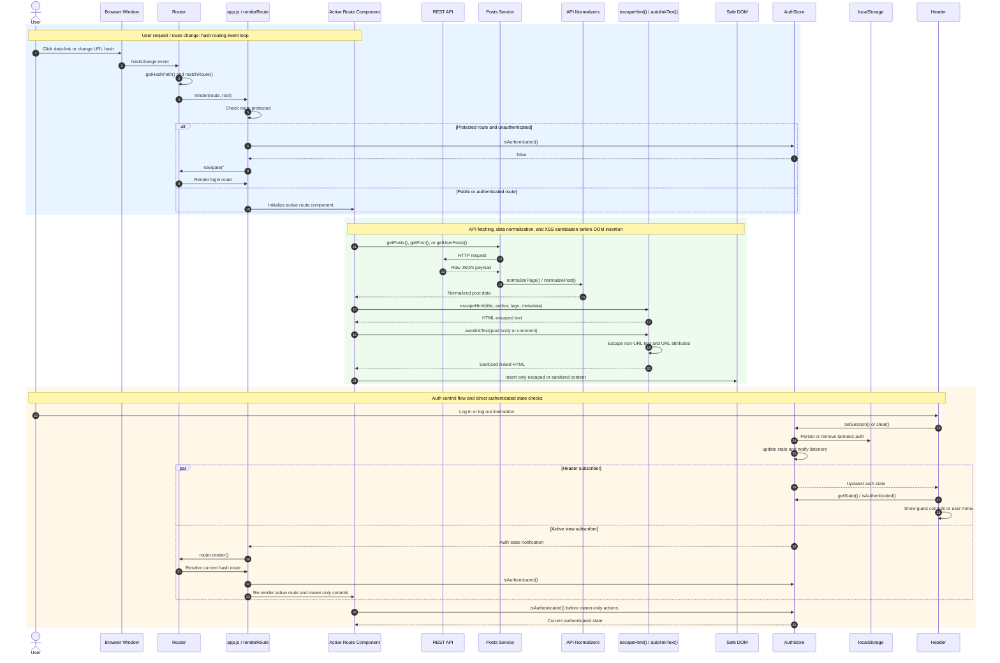

# Tarmeez Security and Routing Sequence

**Version:** v2.0 - Security & Route Sequence

The browser hash is the routing source of truth. Before a protected route renders, `app.js` checks `authStore.isAuthenticated()` and redirects guests to login. REST data is normalized before the view consumes it; every dynamic text value is passed through `escapeHtml()` or `autolinkText()` before HTML insertion. Authentication changes persist state, notify the Header, and re-render the active route so protected and owner-only controls reflect the current session.